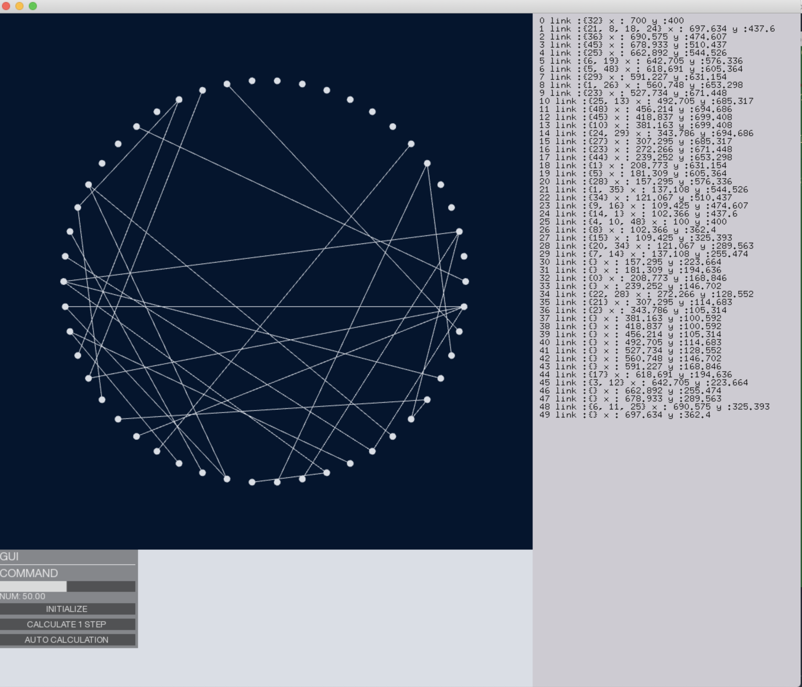

# Auto Position

## Server
- calculation
- `python main.py`
-  python 3.7.1

## client
- Interface

- of-0.10.1
- send command to Server
    - INITIALIZE : set field (server will randomly set the filed)
    - CALCULATE : calculate for one step
    - AUTO CALCULATE : calculate for 1000 steps
- `make; make Release`
